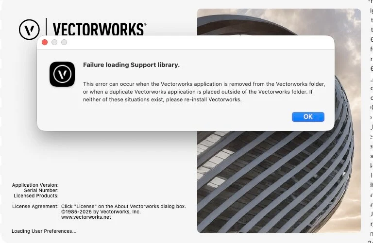
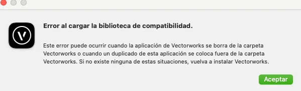

# Fix Vectorworks 2024/2025/2026 Not Launching on macOS 27

[Leer en español](README.es.md)

An unofficial, reversible community workaround for a Vectorworks startup failure on Apple Silicon Macs running macOS 27. In the confirmed Vectorworks 2025 case, `Support.vwlibrary` could not load because it depended on the missing system path `/usr/lib/libiodbc.2.dylib`.

Created by **Wagner R. Ponce — ANIFONIX**.

> [!IMPORTANT]
> This project is not affiliated with, endorsed by, or supported by Vectorworks, Inc., Nemetschek, Apple, or Homebrew. It modifies a vendor-signed Vectorworks component. Review the script, keep a backup, and use it at your own risk.

## Start here — easy instructions

You do not need to understand the technical sections below. Follow these steps in order.

### 1. Check whether this is for you

You need an **Apple Silicon Mac (M1, M2, M3 or newer), macOS 27, and Vectorworks already installed** in its normal Applications folder. This is for the startup error **“Failure loading Support library.”** The script checks whether the specific missing library is present in the dependency list; the dialog alone does not prove this fix applies.

**2025 Update 8: tested. 2024 and 2026: experimental and unverified.** This is an unofficial workaround that changes a Vectorworks component and creates a backup, not a Vectorworks installer or a fix for every crash.

### 2. Download the script

Click [Download the script](https://github.com/wkrodrig/vectorworks-2025-2026-wont-launch-macos27-fix/raw/refs/heads/main/Fix-Vectorworks-iODBC.command). Save it in **Downloads**, keeping the exact name `Fix-Vectorworks-iODBC.command`. If your browser displays the script as text, use its Save option to save the file with that name, without adding `.txt`. You do not need to download the whole repository.

### 3. Open Terminal and check the download

Close Vectorworks. Press **Command + Space**, type **Terminal**, and press **Return**. Copy the following two lines into Terminal and press Return:

```bash
cd "$HOME/Downloads"
shasum -a 256 Fix-Vectorworks-iODBC.command
```

The long string must match this exactly (the filename printed afterward is normal):

```text
f4a450a3de2f8878b8f437a6eeaa3dc6694df583620a53031f6d3adcc72dc37b
```

**If it does not match, stop. Do not run that file.** If Terminal says `No such file or directory`, check that the file is in Downloads with the exact name above.

### 4. Run the checked script

Copy this line into the same Terminal window and press Return:

```bash
/bin/bash "$HOME/Downloads/Fix-Vectorworks-iODBC.command"
```

This Terminal method does not require double-clicking the file or making it executable. Do not disable SIP or Gatekeeper. Running a shell script still executes code: review it before running it.

### 5. Answer the questions and wait

- If several Vectorworks versions are installed, enter the year you want to repair and press Return.
- Read each question. Enter `y` and press Return only if you agree. Homebrew is a tool used to install the missing library; the script asks before installing Homebrew if it is missing.
- If asked for your Mac administrator password, type it and press Return. **No dots or letters appear while you type; this is normal.**
- Keep Terminal open and stay connected to the Internet while installation and repair finish. If developer tools must be installed, follow the macOS prompt and rerun the script after installation.

When finished, the script normally opens Vectorworks. If it stops with an error, do not edit the application manually or keep trying unrelated commands. An error can mean this workaround does not apply. If it says the installation is already patched, there is no need to apply it again.

### Optional: undo the repair

Close Vectorworks, open Terminal, and run the following command. Replace `2025` with `2024` or `2026` if that was the version you repaired:

```bash
/bin/bash "$HOME/Downloads/Fix-Vectorworks-iODBC.command" --rollback --version 2025
```

This restores the script's latest backup for that version; it may bring back the original startup error. It does not uninstall Homebrew or its library.

---

## Technical information — optional reading

The rest of this page explains compatibility, error screenshots, advanced options, and how the workaround works. **You do not need to run the commands below for normal use.**

## Compatibility status

| Vectorworks version | Status | Notes |
|---|---|---|
| Vectorworks 2024 | Experimental, unverified | No successful repair has been confirmed. Applicable only if Support contains arm64 code and the exact missing iODBC dependency. |
| Vectorworks 2025 Update 8 | Tested | Confirmed working on an Apple Silicon Mac with macOS 27.0. |
| Vectorworks 2026 | Experimental | A similar startup problem involving the Support library has been reported, but this repair has not yet been independently tested on 2026. |

The script refuses to patch any version unless it finds the exact dependency:

```text
/usr/lib/libiodbc.2.dylib
```

## Symptoms

Vectorworks quits during startup and may display a localized message indicating that its compatibility or Support library could not be loaded.

### Error-dialog examples

The English screenshot shows the Vectorworks wording **“Failure loading Support library.”** It is a separate visual example, not the capture from the confirmed macOS 27 test.



The Spanish screenshot below is the dialog captured in the confirmed case: **“Error al cargar la biblioteca de compatibilidad.”**



Running the application under LLDB explicitly revealed:

```text
Error loading .../Plug-ins/Support.vwlibrary/Contents/MacOS/Support
Library not loaded: /usr/lib/libiodbc.2.dylib
Reason: tried: '/usr/lib/libiodbc.2.dylib' (no such file), ...
```

Do not use this workaround for an unrelated crash or a different missing library.

## What the script does

The script:

- Requires macOS 27 and an Apple Silicon Mac running natively as `arm64`.
- Detects Vectorworks 2024, 2025 or 2026 in `/Applications`.
- Lets you select a version when multiple versions are installed.
- Marks Vectorworks 2024 and 2026 support as experimental and requests an additional confirmation.
- Checks for Homebrew and asks permission before installing it.
- Installs the Homebrew `libiodbc` formula when required.
- Confirms that the installed library contains `arm64` code and declares compatibility version `4.0.0`.
- Saves the original `Support` executable outside the Vectorworks bundle.
- Saves the original outer code signature when available.
- Changes the Mach-O dependency to `/opt/homebrew/opt/libiodbc/lib/libiodbc.2.dylib`.
- Applies an ad hoc signature and verifies the modified executable and bundle.
- Detects an already-patched installation.
- Provides verification, backup listing, and rollback modes.

It does **not** disable System Integrity Protection and does **not** create or modify files in `/usr/lib`.

## Requirements

- Apple Silicon Mac
- macOS 27
- Vectorworks 2024, 2025 or 2026 installed in its standard `/Applications` location
- Administrator access
- Internet access if Homebrew or `libiodbc` must be installed

## Installation and normal use

1. Download `Fix-Vectorworks-iODBC.command` from this repository.
2. Open Terminal in the download directory.
3. Make it executable:

   ```bash
   chmod +x Fix-Vectorworks-iODBC.command
   ```

4. Run it:

   ```bash
   ./Fix-Vectorworks-iODBC.command
   ```

You can subsequently open it by double-clicking. If macOS blocks the first launch, Control-click the file, choose **Open**, and confirm.

### If macOS says the file cannot be opened

Files downloaded from the Internet may receive Apple's `com.apple.quarantine` attribute. First verify the downloaded script against the checksum published in this repository, and then remove that attribute from this file only:

```bash
cd "$HOME/Downloads"
shasum -a 256 Fix-Vectorworks-iODBC.command
xattr -d com.apple.quarantine Fix-Vectorworks-iODBC.command
chmod +x Fix-Vectorworks-iODBC.command
./Fix-Vectorworks-iODBC.command
```

For the current script, the expected SHA-256 is:

```text
f4a450a3de2f8878b8f437a6eeaa3dc6694df583620a53031f6d3adcc72dc37b
```

If `xattr` reports `No such xattr`, the file is not quarantined; continue with `chmod` and run it. Do not use `xattr -cr` on `/Applications`, your Downloads folder, or another broad directory. Remove quarantine only from the verified script.

The script may request your administrator password. Characters are not displayed while typing a password in Terminal; this is normal.

## Command-line options

```text
--repair         Repair Vectorworks (default action).
--verify         Check the current status without modifying anything.
--rollback       Restore the most recent backup.
--list-backups   List available backups.
--version YEAR   Select Vectorworks 2024, 2025 or 2026.
--yes, -y        Automatically approve required installations.
--no-launch      Do not launch Vectorworks when finished.
--help, -h       Display help.
```

Examples:

```bash
# Repair the only supported version found in /Applications
./Fix-Vectorworks-iODBC.command

# Explicitly repair Vectorworks 2025 without launching it afterward
./Fix-Vectorworks-iODBC.command --version 2025 --no-launch

# Experimental, unverified Vectorworks 2026 path
./Fix-Vectorworks-iODBC.command --version 2026

# Experimental, unverified Vectorworks 2024 path
./Fix-Vectorworks-iODBC.command --version 2024
./Fix-Vectorworks-iODBC.command --verify --version 2024
./Fix-Vectorworks-iODBC.command --rollback --version 2024

# Verify Vectorworks 2025 without modifying it
./Fix-Vectorworks-iODBC.command --verify --version 2025

# List backups for all three versions
./Fix-Vectorworks-iODBC.command --list-backups

# Restore the latest Vectorworks 2025 backup
./Fix-Vectorworks-iODBC.command --rollback --version 2025
```

## Backups and rollback

Backups are kept outside the application bundle:

```text
~/Library/Application Support/Vectorworks 2024 iODBC Fix/backups
~/Library/Application Support/Vectorworks 2025 iODBC Fix/backups
~/Library/Application Support/Vectorworks 2026 iODBC Fix/backups
```

Each backup includes the original executable, its SHA-256 checksum, metadata, and the original outer signature when available.

To restore the latest backup:

```bash
./Fix-Vectorworks-iODBC.command --rollback --version 2025
```

On macOS 27, restoring the original dependency will probably restore the original launch failure as well.

## Manual diagnosis

For Vectorworks 2024 (unverified):

```bash
otool -L "/Applications/Vectorworks 2024/Plug-ins/Support.vwlibrary/Contents/MacOS/Support" | grep -i iodbc
lipo -archs "/Applications/Vectorworks 2024/Plug-ins/Support.vwlibrary/Contents/MacOS/Support"
```

For Vectorworks 2025:

```bash
otool -L "/Applications/Vectorworks 2025/Plug-ins/Support.vwlibrary/Contents/MacOS/Support" | grep -i iodbc
```

For Vectorworks 2026:

```bash
otool -L "/Applications/Vectorworks 2026/Plug-ins/Support.vwlibrary/Contents/MacOS/Support" | grep -i iodbc
```

An affected, unpatched binary reports `/usr/lib/libiodbc.2.dylib`. A successfully patched binary reports `/opt/homebrew/opt/libiodbc/lib/libiodbc.2.dylib`.

## Limitations

- Modifying the executable invalidates the vendor signature, so the script replaces it with an ad hoc signature.
- A Vectorworks update, repair, or reinstallation can overwrite the patch.
- A future Homebrew update could change library compatibility. The script checks the required architecture and compatibility version before patching.
- Vectorworks 2024 and 2026 support is experimental and unverified until dependency, successful startup, signing, and rollback are confirmed on real installations. Adding a version option does not establish compatibility with macOS 27 or other missing libraries.
- The preferred long-term solution is an official Vectorworks update built for macOS 27.

## Privacy

Do not share your Vectorworks serial number, Crash Reporter Key, Incident Identifier, passwords, tokens, or other personal information.

## Project files

- `Fix-Vectorworks-iODBC.command` — standalone repair and rollback script
- `README.md` — English documentation
- `README.es.md` — Spanish documentation
- `CHANGELOG.md` — change history
- `SECURITY.md` — security and privacy guidance
- `LICENSE` — MIT License
- `SHA256SUMS.txt` — file checksum

## References

- [Vectorworks macOS 27 compatibility notice](https://www.vectorworks.co.jp/Support/tips/os_products_goldengate.html)
- [Homebrew libiodbc formula](https://formulae.brew.sh/formula/libiodbc.html)
- [Apple: Dynamic Library Identification](https://developer.apple.com/forums/thread/736719)
- [Apple DTS: modified signed code must be re-signed](https://developer.apple.com/forums/thread/670761)

## Author

**Wagner R. Ponce**  
**ANIFONIX**

## Acknowledgements

Thanks to [@lahmadinia](https://github.com/lahmadinia) for identifying the Universal Binary dependency-detection issue caused by the interaction between `grep -q` and `set -o pipefail`.

## License

Licensed under the [MIT License](LICENSE).
